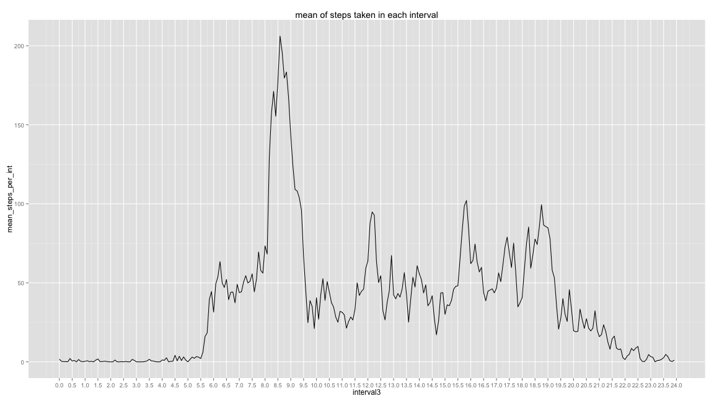

<!-- rmarkdown v1 -->

---
# Title: "Reproducible Research: Peer Assessment 1"
output: 
  html_document:
    keep_md: true
    
---


## Loading and preprocessing the data
Setting directories and libraries.

Dataset was downloaded from [this URL](https://d396qusza40orc.cloudfront.net/repdata%2Fdata%2Factivity.zip) on 2015 January 16th

```r
setwd("/Users/Americo/Documents/Education/Data_science/Coursera/reproducible_research/project/RepData_PeerAssessment1")
act1<-read.csv("activity.csv")
```


```r
library(xtable)
library(grid)
library(gridExtra)
library(ggplot2)
library(plyr)
library(dplyr)
```

```
## 
## Attaching package: 'dplyr'
## 
## The following objects are masked from 'package:plyr':
## 
##     arrange, count, desc, failwith, id, mutate, rename, summarise,
##     summarize
## 
## The following object is masked from 'package:stats':
## 
##     filter
## 
## The following objects are masked from 'package:base':
## 
##     intersect, setdiff, setequal, union
```

## What is mean total number of steps taken per day?`
### 1. Make a histogram of the total number of steps taken each day
To answer this question I aggregated the data using the dplyr package, and calculated the sum of the steps for each single day; then I calculated the mean and median of the number of steps per day and created the histogram with a vertical line for the mean.
I ignore Na's values

```r
#grouping the dataframe to sum the steps on a daily basis
act1_agg1<-group_by(subset(act1,!is.na(steps)), date)
act1_agg2<-summarise(act1_agg1,
                     steps_per_each_day=sum(steps))
head(act1_agg2)
```

```
## Source: local data frame [6 x 2]
## 
##         date steps_per_each_day
## 1 2012-10-02                126
## 2 2012-10-03              11352
## 3 2012-10-04              12116
## 4 2012-10-05              13294
## 5 2012-10-06              15420
## 6 2012-10-07              11015
```

```r
#calculating mean and median
steps_mean<-mean(act1_agg2$steps_per_each_day)
steps_mean<-round(steps_mean, digits=2)
steps_median<-median(act1_agg2$steps_per_each_day)
#plotting the histogram with a vertical line for the mean
g1<-ggplot(data=act1_agg2, aes(x=steps_per_each_day))+
  geom_histogram(color="black", fill="blue", binwidth=500)+
  geom_vline(xintercept=mean(act1_agg2$steps_per_each_day), color="green")+
  scale_x_continuous(breaks=seq(0, max(act1_agg2$steps_per_each_day), 1000))+
  scale_y_discrete(breaks=seq(0,10,1))+
  ggtitle("steps taken each day")
print(g1)
```

 

### 2. Calculate and report the **mean** and **median** total number of steps taken per day
So, the mean total number of steps taken per day is 1.076619 &times; 10<sup>4</sup> and the median is 10765


## What is the average daily activity pattern?
To answer this question I aggregated the data using the dplyr package and calculated the mean of the steps taken for each interval accross days.

### 1. Make a time series plot (i.e. `type = "l"`) of the 5-minute interval (x-axis) and the average number of steps taken, averaged across all days (y-axis)
I decided to decode the interval, so that the next graph would not be affected by **the interval between 55 and 100** and so on.
I did it creating a vector of the same length of the numbers of intervals in a day (288), and I called *interval2*. Then I divided each value for 60; so now for example the interval (called *interval3*) 8.5 now mean the eigth hour and a half

```r
#grouping the dataframe by interval
act1_agg_int<-group_by(subset(act1,!is.na(steps)), interval)
act1_agg_int2<-summarise(act1_agg_int, 
                          mean_steps_per_int=mean(steps))
#calculating the mean
act1_agg_int2$mean_steps_per_int<-round(act1_agg_int2$mean_steps_per_int, digits=2)
#creating a different interval (see the printed subset of the output)
act1_agg_int2$interval2<-seq(0,5*287, 5)
head(act1_agg_int2$interval2, 50)
```

```
##  [1]   0   5  10  15  20  25  30  35  40  45  50  55  60  65  70  75  80
## [18]  85  90  95 100 105 110 115 120 125 130 135 140 145 150 155 160 165
## [35] 170 175 180 185 190 195 200 205 210 215 220 225 230 235 240 245
```

```r
#now i divide this values by 60
act1_agg_int2$interval3<-act1_agg_int2$interval2/60
head(act1_agg_int2, 25)
```

```
## Source: local data frame [25 x 4]
## 
##    interval mean_steps_per_int interval2  interval3
## 1         0               1.72         0 0.00000000
## 2         5               0.34         5 0.08333333
## 3        10               0.13        10 0.16666667
## 4        15               0.15        15 0.25000000
## 5        20               0.08        20 0.33333333
## 6        25               2.09        25 0.41666667
## 7        30               0.53        30 0.50000000
## 8        35               0.87        35 0.58333333
## 9        40               0.00        40 0.66666667
## 10       45               1.47        45 0.75000000
## ..      ...                ...       ...        ...
```

```r
#plotting
g2<-ggplot(data=act1_agg_int2, aes(x=interval3, y=mean_steps_per_int))+
  geom_line()+
  scale_x_continuous(breaks=seq(0, 24.0, .5))+
  ggtitle("mean of steps taken in each interval")
print(g2)
```

 


### Which 5-minute interval, on average across all the days in the dataset, contains the maximum number of steps?

```r
max_steps_int<-act1_agg_int2[which.max(act1_agg_int2$mean_steps_per_int),]
print(max_steps_int)
```

```
## Source: local data frame [1 x 4]
## 
##   interval mean_steps_per_int interval2 interval3
## 1      835             206.17       515  8.583333
```


## Imputing missing values
### Devise a strategy for filling in all of the missing values in the dataset. The strategy does not need to be sophisticated. For example, you could use the mean/median for that day, or the mean for that 5-minute interval, etc
I decided to fill in missing values with the average steps taken for each interval of the day, in order to respect a kind of daily pattern


```r
#merging the activity dataset with the steps mean per interval dataset, so that I am able to fill the NAs with the corresponding
#values of interval3
act1_notNA<-merge(x = act1, y = act1_agg_int2, by = "interval", all.x=TRUE)
act1_notNA<-act1_notNA[order(act1_notNA$date,act1_notNA$interval),]
head(act1_notNA)
```

```
##     interval steps       date mean_steps_per_int interval2  interval3
## 1          0    NA 2012-10-01               1.72         0 0.00000000
## 63         5    NA 2012-10-01               0.34         5 0.08333333
## 128       10    NA 2012-10-01               0.13        10 0.16666667
## 205       15    NA 2012-10-01               0.15        15 0.25000000
## 264       20    NA 2012-10-01               0.08        20 0.33333333
## 327       25    NA 2012-10-01               2.09        25 0.41666667
```

```r
act1_notNA$steps_notNA<-ifelse(is.na(act1_notNA$steps), act1_agg_int2$mean_steps_per_int, act1_notNA$steps)
head(act1_notNA)
```

```
##     interval steps       date mean_steps_per_int interval2  interval3
## 1          0    NA 2012-10-01               1.72         0 0.00000000
## 63         5    NA 2012-10-01               0.34         5 0.08333333
## 128       10    NA 2012-10-01               0.13        10 0.16666667
## 205       15    NA 2012-10-01               0.15        15 0.25000000
## 264       20    NA 2012-10-01               0.08        20 0.33333333
## 327       25    NA 2012-10-01               2.09        25 0.41666667
##     steps_notNA
## 1          1.72
## 63         0.34
## 128        0.13
## 205        0.15
## 264        0.08
## 327        2.09
```

### Create a new dataset that is equal to the original dataset but with the missing data filled in

```r
#subsetting and renaming to create a dataset like the origianl one
row.names=FALSE
act2<-subset(act1_notNA, select=c(steps_notNA, date, interval))
act2<-data.frame(act2, row.names=NULL)
library("reshape")
```

```
## 
## Attaching package: 'reshape'
## 
## The following object is masked from 'package:dplyr':
## 
##     rename
## 
## The following objects are masked from 'package:plyr':
## 
##     rename, round_any
```

```r
act2<-rename(act2,c(steps_notNA="steps"))
head(act2)
```

```
##   steps       date interval
## 1  1.72 2012-10-01        0
## 2  0.34 2012-10-01        5
## 3  0.13 2012-10-01       10
## 4  0.15 2012-10-01       15
## 5  0.08 2012-10-01       20
## 6  2.09 2012-10-01       25
```


## Are there differences in activity patterns between weekdays and weekends?
### 1. Create a new factor variable in the dataset with two levels -- "weekday" and "weekend" indicating whether a given date is a weekday or weekend day.


```r
#converting date as a datetime variable in order to use the function weekdays. I use lubridate package and I set local options to english in order to have appropriate names of the days (I am italian). I use the act2 dataframe because is the one with missing values filled in
Sys.setlocale("LC_TIME","en_US")
```

```
## [1] "en_US"
```

```r
library("lubridate")
```

```
## 
## Attaching package: 'lubridate'
## 
## The following object is masked from 'package:reshape':
## 
##     stamp
## 
## The following object is masked from 'package:plyr':
## 
##     here
```

```r
act2$date2 <- ymd(act2$date)
class(act2$date2)
```

```
## [1] "POSIXct" "POSIXt"
```

```r
#with an ifelse condition I create the factor variable day_type to distinguish the weekdays from the weekend ones
act2$day_type<-ifelse(weekdays(act2$date2)=="Sunday"|weekdays(act2$date2)=="Saturday", "weekend day", "weekday")
act2$day_type<-factor(act2$day_type)
head(act2)
```

```
##   steps       date interval      date2 day_type
## 1  1.72 2012-10-01        0 2012-10-01  weekday
## 2  0.34 2012-10-01        5 2012-10-01  weekday
## 3  0.13 2012-10-01       10 2012-10-01  weekday
## 4  0.15 2012-10-01       15 2012-10-01  weekday
## 5  0.08 2012-10-01       20 2012-10-01  weekday
## 6  2.09 2012-10-01       25 2012-10-01  weekday
```

### 2. Make a panel plot containing a time series plot (i.e. `type = "l"`) of the 5-minute interval (x-axis) and the average number of steps taken, averaged across all weekday days or weekend days (y-axis).
I will do as before, so: 

1. creating a different interval;
2. calculating the mean of steps for each interval, this time grouping by interval and by day type;
3. plotting the graph faceting by day type


```r
#step1: creating a different interval
act2$interval2<-seq(0,287*5,5)/60
act2$interval3<-round(act2$interval2, digits=2)
head(act2)
```

```
##   steps       date interval      date2 day_type  interval2 interval3
## 1  1.72 2012-10-01        0 2012-10-01  weekday 0.00000000      0.00
## 2  0.34 2012-10-01        5 2012-10-01  weekday 0.08333333      0.08
## 3  0.13 2012-10-01       10 2012-10-01  weekday 0.16666667      0.17
## 4  0.15 2012-10-01       15 2012-10-01  weekday 0.25000000      0.25
## 5  0.08 2012-10-01       20 2012-10-01  weekday 0.33333333      0.33
## 6  2.09 2012-10-01       25 2012-10-01  weekday 0.41666667      0.42
```

```r
#step2: calculating mean  grouping the dataframe
act2_agg_int1<-group_by(act2, interval3, day_type)
act2_agg_int1$steps<-round(act2_agg_int1$steps, digits=2)
act2_agg_int2<-summarise(act2_agg_int1,
                         steps_mean=mean(steps))
act2_agg_int2$steps_mean<-round(act2_agg_int2$steps_mean, digits=2)
head(act2_agg_int2)
```

```
## Source: local data frame [6 x 3]
## Groups: interval3
## 
##   interval3    day_type steps_mean
## 1      0.00     weekday       2.25
## 2      0.00 weekend day       0.22
## 3      0.08     weekday       0.45
## 4      0.08 weekend day       0.04
## 5      0.17     weekday       0.17
## 6      0.17 weekend day       0.02
```

```r
#step3: plotting
ggplot(data=act2_agg_int2, aes(x=interval3, y=steps_mean))+
  geom_line()+
  scale_x_discrete(breaks=seq(0,24,.5))+
  facet_grid(day_type~.)+
  ggtitle("pattern in weekdays and weekand days")
```

 
This graph shows us that the pattern are quite similar, with this differences:

- there is a peak in the weekdays at 9 am, probably when people go to work;

- there are higher values in the weekend afternoon, probably beacuse of walks.

I am expecting that the median is higher on weekend compared to weekdays. Let'see

```r
by(act2_agg_int2$steps_mean, act2_agg_int2$day_type, summary)
```

```
## act2_agg_int2$day_type: weekday
##    Min. 1st Qu.  Median    Mean 3rd Qu.    Max. 
##   0.000   2.248  25.800  35.610  50.860 230.400 
## -------------------------------------------------------- 
## act2_agg_int2$day_type: weekend day
##    Min. 1st Qu.  Median    Mean 3rd Qu.    Max. 
##   0.000   1.237  32.340  42.370  74.660 166.600
```

```r
by(act2_agg_int2$steps_mean, act2_agg_int2$day_type, sum)
```

```
## act2_agg_int2$day_type: weekday
## [1] 10255.87
## -------------------------------------------------------- 
## act2_agg_int2$day_type: weekend day
## [1] 12201.45
```
My expectations were true. Mean, median and sum of steps taken for each interval are higher in weekend days.
So, more steps in less peaks... that's relax and health!


## Launching Knitr

```r
library("knitr")
knit2html("/Users/Americo/Documents/Education/Data_science/Coursera/reproducible_research/project/RepData_PeerAssessment1/PA1_template_files/PA1_template.Rmd")
```

```
## Warning in readLines(if (is.character(input2)) {: cannot open file
## '/Users/Americo/Documents/Education/Data_science/Coursera/reproducible_research/project/RepData_PeerAssessment1/PA1_template_files/PA1_template.Rmd':
## No such file or directory
```

```
## Error in readLines(if (is.character(input2)) {: non posso aprire questa connessione
```
